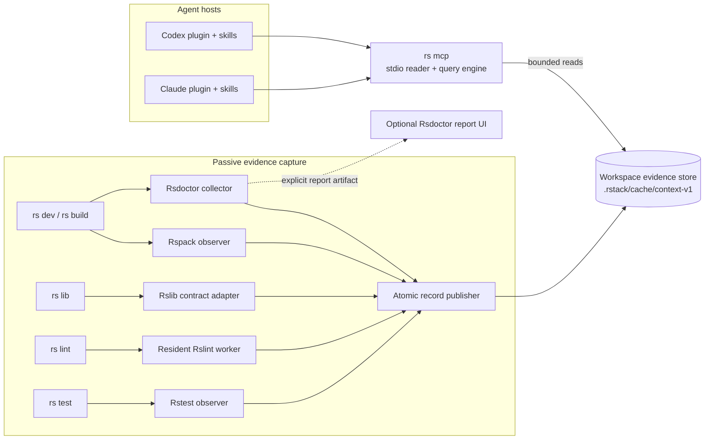
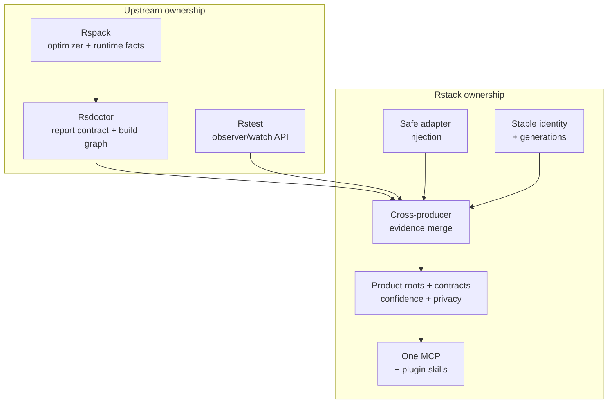
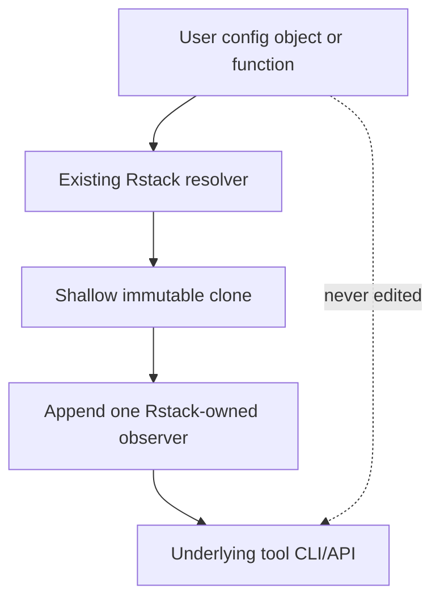
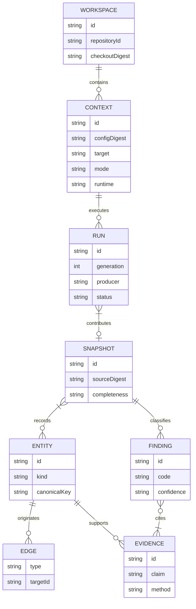
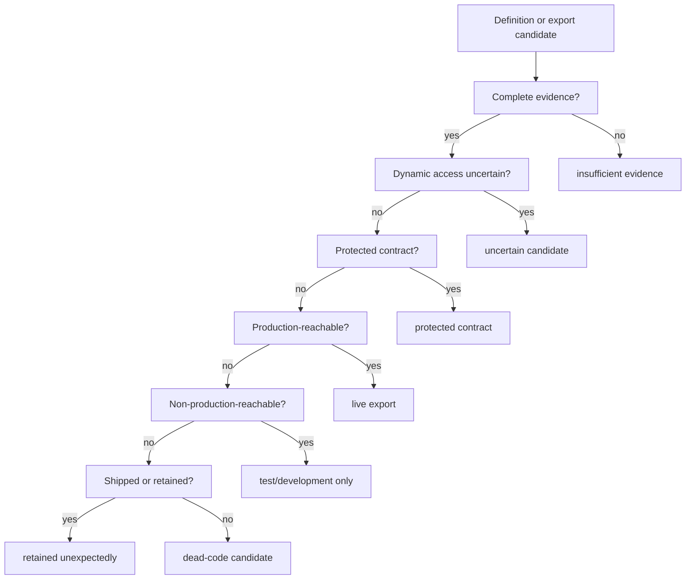
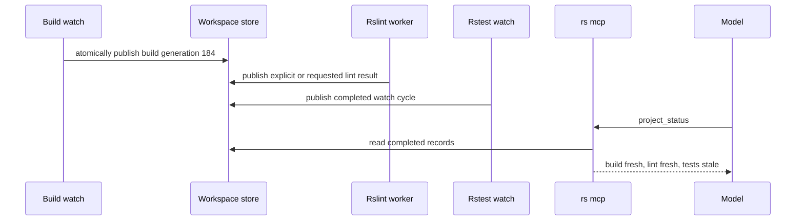
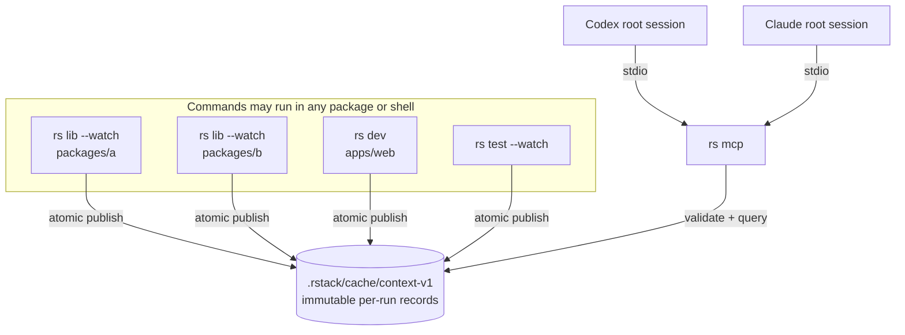
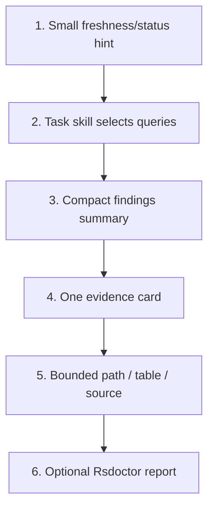
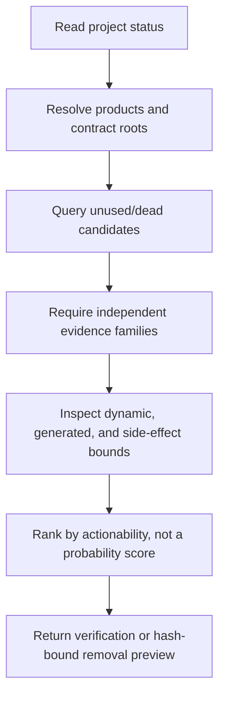
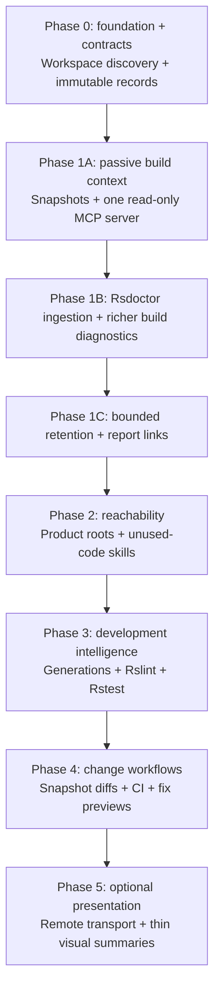

# RFC 0001: Rstack context engine

| Field   | Value                                                                              |
| ------- | ---------------------------------------------------------------------------------- |
| Status  | Proposed                                                                           |
| Created | 2026-08-12                                                                         |
| Target  | `rstack`, Rspack 2, Rsbuild 2, Rslib 1, Rstest 0.11, Rslint 0.7, Rsdoctor 2        |
| Scope   | Headless build, lint, test, reachability, and package-contract evidence for agents |

## Summary

This RFC proposes a headless Rstack Context Engine that turns facts from Rsbuild, Rspack, Rslib,
Rslint, Rstest, and Rsdoctor into versioned evidence snapshots. One workspace-bound MCP server
exposes compact queries over those snapshots. Codex and Claude plugin bundles add task-oriented
skills that teach models how to combine the evidence safely.

The first product use case is unused and dead-code investigation. The engine does not equate
"not observed" with "dead." It keeps the following claims independent:

1. Is the definition reachable from a configured production root?
2. Is it reachable only from tests, examples, benchmarks, or development tooling?
3. Is it part of a published or otherwise protected public contract?
4. Was it shipped in a specific build and runtime?
5. Was it executed by a specific test capture?
6. Did the optimizer retain it for side effects or because analysis was incomplete?

Rsdoctor supplies the canonical build-analysis data and remains the optional rich report viewer.
Its GUI is not required by the context engine, MCP server, Codex plugin, Claude plugin, or CI.

## Motivation

Rstack already presents one CLI and one configuration file for the JavaScript toolchain, but the
underlying tools expose different kinds of useful information:

- Rspack knows the exact resolved production graph, chunks, runtimes, used exports, optimization
  bailouts, and emitted assets.
- Rsdoctor enriches that graph with bundle, package, loader, plugin, rule, and tree-shaking data.
- Rslib knows which library variants are shipped and how package exports and externalization define
  a consumer-facing contract.
- Rslint has high-confidence lexical and type-aware diagnostics, including unused local symbols and
  safe fix information.
- Rstest knows the test projects, related-test graph, results, coverage, retries, snapshots, and
  development-only consumers.

Today an agent must invoke those tools separately, parse incompatible output, infer freshness, and
reconstruct causal links. Raw output also encourages unsafe conclusions: an unused export in one
browser build might be a public library API, a server-only export, a dynamic entry, or a test-only
helper.

The context engine makes the combined evidence queryable without placing large logs, graphs, or
source files into the model context.

## Goals

- Provide one local, workspace-bound MCP surface for Rstack project intelligence.
- Reuse Rsdoctor's data model and headless analyzers instead of rebuilding its GUI or collectors.
- Model production, non-production, public-contract, build, and execution evidence independently.
- Support Rstack applications, libraries, multi-environment builds, and workspaces.
- Preserve user configuration and plugin order while adding opt-in passive observers.
- Keep build, lint, and test states independently fresh during development.
- Return small, typed, paginated answers with provenance, confidence, completeness, and source
  locations.
- Offer task-oriented Codex and Claude skills for unused code, build analysis, impact analysis,
  diagnostics, and test selection.
- Fail open: a collector or context-engine failure must not fail the user's build, dev server, lint,
  or test command.
- Establish explicit safety boundaries for repository trust, source access, command execution, and
  mutation.

## Non-goals

- Replacing the Rsdoctor report UI.
- Exposing MCP through an Rsbuild development-server route.
- Proving arbitrary local-symbol elimination from source maps or minified output.
- Treating a single build, test run, or coverage capture as proof that code is globally dead.
- Starting builds, tests, watchers, or long-lived report servers automatically when an agent session
  opens.
- Sending source, configuration, environment variables, or build reports to a remote service.
- Replacing Knip, dependency-cruiser, CodeQL, or architecture-policy tools. Their evidence may be
  integrated later as additional producer facets.
- Editing user configuration files to install instrumentation.

## Design principles

### Facts first, decisions later

The compilers and runners collect facts. A workspace-level analyzer makes conclusions only after
merging all relevant product and non-product captures.

This follows the core architecture of Astral's Hawk: each compiler invocation emits a fragment,
then a separate graph analysis combines production and non-production fragments before deciding
whether public Rust APIs are dead or unnecessarily visible. Rstack applies the same separation to
JavaScript build, library, lint, and test evidence while accounting for dynamic imports, CommonJS,
package exports, side effects, multiple runtimes, and external consumers.

### Headless first

Structured artifacts and APIs are the system of record. Visual reports project the same evidence;
they are never required to answer a query.

### Progressive disclosure

The model initially receives a short status or finding summary. It requests evidence paths,
diagnostics, logs, modules, or source only when needed. The server never returns an unbounded raw
Rspack Stats object or complete Rsdoctor report.

### Honest uncertainty

The engine uses categorical confidence (`exact`, `derived`, `inferred`, or `unknown`) and explicit
analysis bounds. It does not invent a single dead-code probability.

### Stable meaning over producer internals

Rspack module IDs, Rsdoctor numeric keys, PIDs, ports, and watch-cycle counters are capture-local.
The engine normalizes them into stable semantic identities and retains the original producer IDs as
provenance only.

## Terminology

| Term          | Definition                                                                                    |
| ------------- | --------------------------------------------------------------------------------------------- |
| Repository    | Stable source identity shared by related clones and working trees when it can be established. |
| Workspace     | One authorized checkout or worktree and its allowed filesystem roots.                         |
| Product       | A shipped application entry, server entry, worker, CLI, or library contract.                  |
| Context       | One normalized combination of config, target, mode, runtime, environment, and conditions.     |
| Run           | A producer execution such as a build, lint request, or test cycle.                            |
| Generation    | A producer-local monotonically increasing build, lint, or test cycle.                         |
| Snapshot      | An immutable, queryable view assembled from one or more runs.                                 |
| Facet         | Producer-specific evidence attached to a normalized entity.                                   |
| Evidence      | An immutable observation supporting or weakening a claim.                                     |
| Finding       | A classified, actionable claim with explicit bounds and evidence.                             |
| Root          | A definition or module from which reachability is computed.                                   |
| Contract root | An entry that external consumers are allowed to import or invoke.                             |

## Architecture

### System overview



### Component responsibilities

| Component              | Responsibility                                                                                             | Must not do                                                               |
| ---------------------- | ---------------------------------------------------------------------------------------------------------- | ------------------------------------------------------------------------- |
| Tool adapter           | Add one passive collector after the user's resolved configuration and correlate its lifecycle with a run.  | Modify the user's config file, reorder user plugins, or fail the command. |
| Producer               | Emit bounded, schema-versioned facts and completeness metadata into its own immutable run directory.       | Make cross-tool dead-code decisions or mutate another producer's record.  |
| Workspace store        | Provide a disposable, task-runner-independent rendezvous of atomically published records for one checkout. | Execute project code, schedule tasks, or require a resident process.      |
| Status reader/analyzer | Validate records and compute roots, reachability, contracts, findings, explanations, and diffs.            | Hide malformed, unsupported, unknown, or partial evidence.                |
| MCP broker             | Expose one stdio server, enforce roots/capabilities, paginate output, and link resources.                  | Mount on a development server or expose a second Rsdoctor MCP endpoint.   |
| Skills                 | Choose the correct queries, combine evidence, explain limits, and guide safe next actions.                 | Parse raw logs or represent candidates as proven dead.                    |

### Upstream and downstream ownership



Rspack and Rsdoctor own facts that cannot be reconstructed reliably after compilation: provided
exports with zero active edges, optimizer usage state, side-effect decisions, runtime activity,
dependency locations, transformed declarations, and optimization bailouts. Rstack owns composition,
not duplicate compiler instrumentation.

## Evidence producers

### Rsbuild and Rspack

Rstack adds one global Rsbuild observer after resolving the user's app configuration. The observer
uses documented Rsbuild lifecycle hooks for environment/config/build events and a final
`tools.rspack` composition to append one no-op Rspack observer per environment.

The default capture includes:

- command, environment, target, mode, runtime, tool versions, and config fingerprint;
- build start, completion, failure, restart, close, and watch change sets;
- minimal Stats for hashes, timings, assets, chunks, diagnostics, entrypoints, and module inventory;
- completeness and extraction-cost metadata.

Deep build capture is opt-in and adds:

- module reasons and issuer paths;
- provided and used exports;
- optimization bailouts;
- runtime-aware ModuleGraph and ChunkGraph edges;
- Rsdoctor export-usage and tree-shaking data;
- bounded source-map attribution.

Collection occurs only at lifecycle points where Rspack data is complete. JS proxy objects are
serialized immediately and never retained between callbacks.

### Rsdoctor

Rsdoctor is the canonical build-analysis provider. The context engine consumes static
`rsdoctor-data.json` or a normal `.rsdoctor/manifest.json` and its shards. It integrates
`@rsdoctor/agent-cli` in-process and reuses `@rsdoctor/shared` graph and diff operations where a
stable public surface exists.

The default agent path does not depend on:

- `@rsdoctor/client`;
- an HTTP or Socket.IO report server;
- the removed legacy `@rsdoctor/mcp-server`;
- a browser session.

The Rsdoctor GUI remains available through an explicit `report_link` result for investigations where
a treemap or large interactive graph is materially more useful than a bounded path or table.

### Rslib

Rstack adds one global Rsbuild-compatible observer after resolving the CLI-specific Rslib config.
The adapter does not modify `lib[]` entries or the shared resolver used by Rstest.

Rslib contributes:

- selected library variants and environment identities;
- entry files, output formats, targets, filenames, and bundleless mode;
- `autoExternal` and explicit externals intent;
- emitted outputs and Stats per environment;
- declaration-output intent and coarse completion state;
- package name, files, `main`, `module`, `types`, `exports`, and `bin` contract roots;
- validation of package-export targets against actual outputs.

Published libraries default to an open-world public contract. Internal libraries may opt into
closed-world workspace analysis.

### Rslint

One resident `Rslint` engine per workspace provides structured `lintFiles` and `lintText` results.
Requests are serialized through the engine. Rstack uses the generated Rslint config file so project
plugins and configuration behave exactly like `rs lint`.

Rslint contributes:

- lexical unused locals, parameters, private members, and unreachable-code diagnostics;
- rule IDs, severity, locations, suggestions, and fix ranges;
- whole-file fixed output for previews;
- optional TypeScript compiler diagnostics through a captured CLI subprocess.

The public JS API has no cancellation or type-check/timing surface. Hard cancellation therefore
requires a killable worker or one-shot subprocess and recreation of the resident engine.

### Rstest

Rstest contributes two distinct evidence families:

- static module dependency: which tests are related to a changed source file;
- runtime execution: which source ranges were covered by a specific test capture.

Those signals never collapse into one claim. A related test can import a module without executing a
symbol, and a coverage hit can come from setup, module initialization, hooks, or shared state.

The observer records run, file, suite, case, diagnostic, console, retry, snapshot, coverage, and
completion events. Project configuration supplies environment/browser metadata that reporter events
do not carry directly.

Rstest's current programmatic and reporter APIs are experimental and must be pinned to an exact patch.
A supported append-only observer and watch-session control API should be added upstream before Rstack
offers first-class MCP watch control.

### Workspace and Git

Every snapshot records the source revision, dirty-diff digest, config file and dependency digest,
selected products, platform, command, and producer versions. Absolute paths, raw environment
variables, and arbitrary config objects are not persisted.

## Configuration and activation

Passive collection is off until the repository is trusted. This RFC adds an optional `context`
section to Rstack configuration for product intent and limits:

```ts
export default define({
  context: {
    enabled: true,
    products: [
      { config: 'app', kind: 'application' },
      { config: 'lib', kind: 'published-library' },
    ],
    capture: 'metadata',
    tests: 'attach',
    retention: {
      snapshots: 20,
      maxBytes: 100 * 1024 * 1024,
    },
  },
});
```

The normative behavior is:

- `metadata` is the default capture tier;
- `capture` accepts `off`, `metadata`, or `deep`;
- `tests` accepts `off` or `attach`; test execution is never implied;
- `products` is required only when Rstack cannot infer a safe application or published-library
  product from `define.app` or `define.lib`;
- deep graph/source capture requires an explicit setting or command;
- tests attach only to a user-started Rstest session;
- CI does not persist or listen unless explicitly configured to emit a redacted artifact;
- `RSTACK_CONTEXT=0` is an emergency opt-out;
- instrumentation changes the resolved in-memory config only and never writes the user's config file.

## Safe configuration injection



The injection points are intentionally tool-specific:

| Tool    | Injection point                                            | Reason                                                                                     |
| ------- | ---------------------------------------------------------- | ------------------------------------------------------------------------------------------ |
| Rsbuild | After `resolveRsbuildConfig` in `rsbuildConfig.ts`         | Covers app CLI runs without leaking instrumentation into Rstest's app extension.           |
| Rspack  | Final composed `tools.rspack` result                       | Observes the actual bundler config after user composition.                                 |
| Rslib   | After CLI-only `resolveRslibConfig`                        | One global plugin covers all generated library environments without duplicating callbacks. |
| Rstest  | Append observer after configured reporters are constructed | Rstest reporter configuration is replace-not-concatenate.                                  |
| Rslint  | Programmatic `Rslint` instance using generated config      | Preserves structured diagnostics; CLI is retained only for type-check/timing gaps.         |

Observers must be per-instance idempotent, never module-global. They must not mutate hook arguments,
return values, assets, graphs, or diagnostics.

## Information model

### Core entities



Entity kinds include workspace, product, environment, route entry, module, symbol, export, package,
test project, test file, test case, chunk, asset, diagnostic, and report.

Normalized edge kinds include:

- `imports`, `dynamic_imports`, `requires`, and `reexports`;
- `declares`, `exports`, and `contract_exposes`;
- `routes_to`, `included_in`, and `emits`;
- `exercises`, `covers`, and `related_to_test`;
- `retained_for_side_effect`, `retained_by_bailout`, and `diagnosed_by`.

### Identity

- Repository IDs derive from canonical repository identity when available and remain stable across
  related working trees.
- Workspace IDs are checkout/worktree-scoped. Their opaque value may incorporate a canonical root or
  Git worktree identity, but absolute paths are never exposed through the MCP contract.
- Context IDs derive from normalized config, target, mode, runtime, conditions, and redacted
  environment digest.
- Semantic module, symbol, export, package, test, chunk, and route IDs are deterministic within a
  workspace and do not include snapshot IDs.
- Snapshot and run IDs are immutable time-sortable IDs.
- Evidence IDs are content-addressed.
- Producer-local numeric IDs remain in the provenance facet only.

### Evidence envelope

```json
{
  "schemaVersion": 1,
  "id": "ev_…",
  "producer": "rspack",
  "producerVersion": "2.x",
  "runId": "run_…",
  "generation": 184,
  "contextId": "ctx_…",
  "observedAt": "2026-08-12T03:30:00Z",
  "method": "export_usage_graph",
  "claim": "export has no active incoming edge in runtime main",
  "source": {
    "uri": "rstack://workspace/ws_…/source/packages/app/src/feature.ts",
    "range": {
      "startLine": 12,
      "startColumn": 1,
      "endLine": 18,
      "endColumn": 2
    },
    "digest": "sha256:…"
  },
  "bounds": {
    "products": ["browser-production"],
    "runtimes": ["main"],
    "dynamicAccess": "unknown"
  }
}
```

### Freshness, completeness, and confidence

These dimensions are independent:

| Dimension    | Values                                                               | Meaning                                                             |
| ------------ | -------------------------------------------------------------------- | ------------------------------------------------------------------- |
| Status       | `queued`, `running`, `pass`, `fail`, `cancelled`, `error`, `skipped` | What happened during the run.                                       |
| Freshness    | `live`, `fresh`, `stale`, `partial`, `unknown`                       | Whether the result applies to the current generation/source digest. |
| Completeness | Per-producer section map                                             | Which facts were collected, disabled, truncated, or unsupported.    |
| Confidence   | `exact`, `derived`, `inferred`, `unknown`                            | How directly the conclusion follows from the evidence.              |

A green result may be stale. An empty section may mean "nothing found," "collector disabled," or
"producer unsupported"; the schema must preserve that distinction.

## Product and reachability model

### Root classes

| Root class                | Examples                                                                         | Default policy                                       |
| ------------------------- | -------------------------------------------------------------------------------- | ---------------------------------------------------- |
| Production executable     | Browser entry, server entry, worker, Node CLI                                    | Seeds production reachability.                       |
| Published contract        | `package.json#exports`, `main`, `module`, `types`, `bin`                         | Protected from closed-world deletion.                |
| Internal library          | Workspace-only library explicitly declared internal                              | Uses actual workspace consumers as roots.            |
| Non-production executable | Test, example, benchmark, doctest-equivalent, setup file                         | Seeds non-production reachability only.              |
| Conservative runtime root | Dynamic namespace, nonliteral CommonJS, reflection, registration, generated code | Preserves liveness and lowers confidence.            |
| Side-effect root          | Explicit or inferred effectful module                                            | Preserves module execution, not necessarily exports. |

### Independent state axes

Each definition is classified along at least these axes:

```text
productionReachability:      live | unreachable | unknown
nonProductionReachability:   live | unreachable | unknown
publicContract:              required | not-required | unknown
shipped:                     yes | no | unknown        (per build/runtime)
executed:                    yes | no | unknown        (per capture)
optimizerRetention:          used | side-effect | bailout | removed | unknown
```

### Finding classifier



### Finding codes

| Code                        | Meaning                                                                                          | Default action                                                        |
| --------------------------- | ------------------------------------------------------------------------------------------------ | --------------------------------------------------------------------- |
| `unused-local`              | Rslint proves a non-exported local/private definition is unused.                                 | Offer a lint fix preview when available.                              |
| `unused-export`             | An export is provided but unused in all selected production runtimes.                            | Investigate contract and dynamic bounds; do not delete automatically. |
| `dead-export`               | The export is unreachable from production and non-production roots and is not contract-required. | Offer a removal plan after verification.                              |
| `unnecessary-export`        | The definition is live but no selected consumer requires it to be exported.                      | Offer visibility/export reduction.                                    |
| `test-only-export`          | Reachable only from tests or other non-production roots.                                         | Explain test-only status; avoid production bundle claims.             |
| `dead-module`               | No selected root reaches the module and no required side effect preserves it.                    | Offer module removal after multi-context verification.                |
| `retained-for-side-effects` | No exports are used, but the module is retained for effects.                                     | Explain effect locations and package metadata.                        |
| `tree-shaking-bailout`      | Rspack cannot optimize the module/export as expected.                                            | Explain bailout and likely remediation.                               |
| `not-shipped`               | Present in source but absent from a specific build.                                              | Report as build-scoped evidence, not global dead code.                |
| `not-executed`              | Included in coverage scope but had no hits in a capture.                                         | Report as test-scoped evidence, not reachability proof.               |
| `insufficient-evidence`     | Required producers were disabled, stale, truncated, or unsupported.                              | Recommend the smallest safe capture that fills the gap.               |

Arbitrary local-symbol DCE remains heuristic unless Rspack exposes its internal inner-graph facts.
Source-map absence is not proof because inlining, renaming, minification, concatenation, and constant
folding can remove names and ranges.

## Development and watch mode

Build, lint, and test must remain independent. Lint and test never block HMR or change the Rsbuild
success result.



Example status exposed to the model:

```text
DEV  source=9a73f2 + 2 uncommitted files
Build  PASS     412ms  [FRESH: build generation 184]
Lint   RUNNING         [lint generation 52]
Tests  PASS     31/31  [STALE: test cycle 31; 2 changed files]
Next   wait for lint, or inspect the changed-file diagnostics already available
```

Rslint behavior during development:

- no background lint process is started merely because a dev server or MCP client exists;
- an explicit `rs lint` run publishes its result, while an approved MCP lint request may reuse one
  resident engine within that MCP process;
- lint requested or explicitly changed files without blocking build or HMR;
- schedule program-wide type checking on explicit request or idle policy;
- bind each result to its producer generation and source digest;
- cancel by terminating and recreating the worker only when necessary.

Rstest behavior during development:

- attach only when the user already started `rs test --watch` or explicitly requested it;
- correlate each watch cycle with its source digest and the nearest observed build generation;
- use related-test evidence to explain affected selection;
- preserve previous results as stale until the new cycle finishes;
- distinguish cancellation, infrastructure failure, and product test failure;
- never claim exact case-to-symbol execution without an appropriately scoped coverage capture.

## Workspace store and transport

### Process model

Version 1 requires no coordinator process. Rstack commands and watch processes resolve identity from
their actual loaded config or package path and atomically publish into the checkout-local disposable
cache. Agent hosts may launch `rs mcp` from the repository root, a package, or another authorized MCP
root; the broker locates the workspace store without treating its CWD as package or build identity.



Each producer owns `runs/<runId>`. It first publishes an immutable run manifest, then publishes each
completed context generation under that run. Publication writes a unique same-directory temporary
file and atomically links it into its final name; readers ignore temporary files and never observe a
partially written completed record.

```text
.rstack/cache/context-v1/
└── runs/
    └── <runId>/
        ├── run.json
        └── contexts/
            └── <contextId>/
                └── generations/
                    └── <sequence>-<snapshotId>.json
```

The resolved hierarchy is checkout → package → tool/config → product → environment → run →
generation. A single Rslib process may therefore publish separate ESM, CJS, DTS, or bundleless
contexts, and a single Rsbuild process may publish client, server, or worker contexts. Concurrent
processes targeting the same context remain separate sessions; status reports ambiguity rather than
silently choosing one.

Workspace discovery prefers the nearest package-manager workspace manifest, then a Git checkout
marker, then the nearest package root. It requires neither Turbo nor Nx and does not parse their task
graphs. Rstack CLI users receive adapters through resolved-config injection. Direct Rsbuild, Rspack,
Rslib, and Rstest users must add the corresponding explicit Rstack plugin or reporter; arbitrary
third-party processes cannot be instrumented safely by inference.

Commands may start before the MCP process, and multiple MCP processes may read the same records. Each
broker keeps only a disposable in-memory query cache. A resident coordinator may be reconsidered if
measured multi-client cache duplication or event throughput proves it necessary; it is not part of
the version 1 contract.

Loopback Streamable HTTP may be added later for explicit multi-client use. It is not the default and
must require a random bearer capability, strict origin validation, session limits, and loopback-only
binding.

### Storage

- Completed records are immutable; incomplete run directories and temporary files are not queryable.
- Snapshots are immutable and content-addressed where practical.
- Only a bounded latest history is retained by default.
- Source, maps, logs, coverage, and deep graphs have independent caps and retention policies.
- The store is disposable cache, never the only copy of a user artifact.
- Raw Rsdoctor artifacts stay in their project-selected output location and are not copied unless a
  snapshot explicitly requires it.

## MCP contract

### One server

The Codex and Claude bundles register one local stdio server named `rstack`. Rsdoctor tools are
adapted behind it; the legacy live Rsdoctor MCP server is not started.

### Resources

```text
rstack://workspace/{workspaceId}/contexts
rstack://context/{contextId}/head
rstack://context/{contextId}/live/{kind}/{entityId}
rstack://snapshot/{snapshotId}
rstack://snapshot/{snapshotId}/{kind}/{entityId}
rstack://query/{queryHandle}
rstack://run/{runId}/events
```

Live resources resolve one head snapshot per read and may be subscribed to. Snapshot resources are
immutable. Large catalogs are discoverable through resource templates and tool-returned links, not
through an unbounded `resources/list`.

### Read-only tools

| Tool                 | Purpose                                                                                        |
| -------------------- | ---------------------------------------------------------------------------------------------- |
| `project_status`     | Return active contexts, producer health, current generations, freshness, and evidence gaps.    |
| `findings_list`      | Filter and page findings by code, product, package, path, confidence, freshness, and severity. |
| `finding_explain`    | Return the shortest causal/evidence paths, bounds, counter-evidence, and safe next actions.    |
| `entity_get`         | Get one normalized entity and selected producer facets.                                        |
| `relationship_trace` | Traverse bounded dependencies, dependents, routes, tests, chunks, or export-use paths.         |
| `snapshot_list`      | List recent compatible snapshots.                                                              |
| `snapshot_diff`      | Compare findings, sizes, diagnostics, tests, and graph edges between compatible snapshots.     |
| `diagnostics_list`   | Return deduplicated build, lint, type, test, and Rsdoctor diagnostics.                         |
| `tests_related`      | Explain static related-test selection for files or modules.                                    |
| `coverage_scope`     | Return bounded execution evidence for files, symbols, or tests.                                |
| `rsdoctor_analyze`   | Invoke the supported in-process Agent CLI catalog against an explicit artifact.                |
| `report_link`        | Return an explicit command/resource link for opening an existing Rsdoctor report.              |

Read-only tools use `readOnlyHint: true`, `destructiveHint: false`, and `openWorldHint: false`.

### Mutating tools

Mutation is a later phase and remains separate:

- `refresh_context` may run configured collectors only after explicit approval;
- `run_build`, `run_lint`, and `run_test` execute repository code and require approval;
- `apply_fix_preview` applies only a prior hash-bound preview to explicit paths;
- snapshot pin/unpin affects context-engine cache only.

Run tools are conservatively annotated as non-read-only, destructive, and open-world because project
plugins and tests may execute arbitrary code.

### Query consistency and pagination

Every query without an explicit snapshot captures the current head once. A TTL-bound query handle
pins that snapshot and authorization scope. Opaque cursors page the frozen result. Responses include
totals, truncation, completeness, and the snapshot ID.

### Progressive model presentation



The default response is decision-ready and short:

```text
UNUSED CODE  snapshot=snap_01…  source=9a73f2 + 2 files  [PARTIAL]
Candidates  7 exports · 2 modules · 4 high-confidence unused locals
Strongest   packages/app/src/legacy.ts:18 `parseLegacyToken`
Evidence    no production/test inbound path; absent from browser+node output
Boundary    package is internal; dynamic CommonJS scan incomplete
Next        inspect the only dynamic loader before proposing removal
```

An expanded finding is an evidence card, not a log dump:

```json
{
  "id": "finding_…",
  "code": "dead-export",
  "subject": {
    "name": "parseLegacyToken",
    "location": "packages/app/src/legacy.ts:18"
  },
  "state": {
    "productionReachability": "unreachable",
    "nonProductionReachability": "unreachable",
    "publicContract": "not-required",
    "shipped": "no",
    "executed": "unknown"
  },
  "confidence": "derived",
  "freshness": "fresh",
  "evidence": ["ev_static_graph", "ev_rspack_browser", "ev_rspack_node"],
  "bounds": ["dynamic CommonJS scan incomplete"],
  "actions": ["trace dynamic loaders", "preview removal", "copy verification command"]
}
```

## Plugin bundles

### Codex

```text
rstack-codex-plugin/
├── .codex-plugin/plugin.json
├── .mcp.json
├── mcp/server.mjs
└── skills/
    ├── orient-rstack-project/
    ├── find-unused-code/
    ├── explain-dead-code/
    ├── assess-change-impact/
    ├── analyze-build/
    ├── debug-dev-cycle/
    ├── select-affected-tests/
    └── review-build-regression/
```

Codex workflows are skills. Version 1 does not require hooks, an app, a bundled LSP, or a separate
subagent registry. The prebuilt MCP runtime and compatible Rsdoctor Agent CLI are pinned in the
published artifact.

### Claude code

```text
rstack-claude-plugin/
├── .claude-plugin/plugin.json
├── .mcp.json
├── server/context.mjs
├── skills/
│   ├── orient-rstack-project/
│   ├── find-unused-code/
│   ├── explain-dead-code/
│   ├── assess-change-impact/
│   ├── analyze-build/
│   ├── debug-dev-cycle/
│   └── select-affected-tests/
├── agents/
│   ├── code-explorer.md
│   ├── change-impact-reviewer.md
│   └── build-performance-analyst.md
└── workflows/
    ├── review-change.js
    └── build-regression.js
```

Claude Code skills and agents share the same MCP schemas and evidence semantics. State is stored in
the host-provided plugin data directory, never the immutable plugin cache. A startup hook is omitted
until `project_status` is proven consistently fast and side-effect-free.

## Skill design

Skills are the primary user-facing interface. MCP tools provide facts; skills provide workflow,
selection policy, safety rules, and presentation.

| Skill                     | Trigger examples                                                   | Evidence workflow                                                                                                                 |
| ------------------------- | ------------------------------------------------------------------ | --------------------------------------------------------------------------------------------------------------------------------- |
| `orient-rstack-project`   | "How is this project structured?", "What Rstack tools are active?" | Status → products/contexts → architecture summary → freshness gaps.                                                               |
| `find-unused-code`        | "Find dead code", "What can I remove?", "Unused exports"           | Establish products/contracts → list candidates → require independent signals → rank → inspect uncertainty → propose verification. |
| `explain-dead-code`       | "Why is this considered dead?", "Why is this retained?"            | Resolve subject → shortest root paths → optimizer/side-effect evidence → tests/contract evidence → bounds.                        |
| `assess-change-impact`    | "What breaks if I change this?", "Who depends on X?"               | Resolve entity → dependents across contexts → affected products/tests/chunks → stale/unknown edges.                               |
| `analyze-build`           | "Why is the bundle large?", "Why isn't this tree-shaken?"          | Select fresh Rsdoctor artifact → summary → narrow query → ranked evidence → optional report link.                                 |
| `debug-dev-cycle`         | "Why is dev stale?", "What failed after my edit?"                  | Correlate generation → show build/lint/test states → first actionable failure → exact rerun.                                      |
| `select-affected-tests`   | "What tests should I run?"                                         | Static related tests → changed context → prior coverage → explicit selection rationale and gaps.                                  |
| `review-build-regression` | "What changed in this build?"                                      | Validate comparable snapshots → diff → regressions/fixes → causal module/package paths.                                           |

### Normative `find-unused-code` workflow



The skill must:

1. Refuse to analyze a published library as a closed world unless explicitly configured.
2. Prefer high-confidence Rslint local findings before cross-module candidates.
3. Distinguish unused export, unreachable source, not shipped, not executed, and optimizer bailout.
4. Require at least two independent evidence families before recommending deletion of an exported
   definition.
5. Treat dynamic imports, nonliteral `require`, reflection, registration, generated code, and missing
   contexts as uncertainty.
6. Show the shortest evidence path and the analysis bounds.
7. Never apply edits directly; produce a preview and verification plan.

### Skill output contract

Every investigative skill returns:

- conclusion and finding code;
- status, freshness, completeness, and confidence;
- direct evidence with source locations;
- shortest causal paths;
- known bounds and counter-evidence;
- one safe recommended next action;
- snapshot/run provenance;
- resource links for deeper inspection.

## Security and privacy

### Trust boundary

Rstack configuration, plugins, tests, reports, source comments, diagnostics, and paths are untrusted
project input. They may contain prompt injection or secrets. The server treats them as data, never as
instructions.

### Capability tiers

| Tier | Access                                                            | Default                         |
| ---- | ----------------------------------------------------------------- | ------------------------------- |
| 0    | Tool versions, contexts, run status, counts, freshness            | Enabled after repository trust. |
| 1    | Sanitized diagnostics, package/module names, relative paths       | Enabled after repository trust. |
| 2    | Source ranges, graph paths, maps, logs, coverage, report contents | Explicit workspace capability.  |
| 3    | Build, test, lint, refresh, or mutation                           | Explicit per-action approval.   |

### Required controls

- Host-facing transport is stdio; producers and brokers exchange evidence only through the
  checkout-local project cache in version 1.
- Never expose MCP or report queries on the dev-server host/port.
- Resolve and realpath every requested path; reject traversal, symlink escape, and paths outside MCP
  roots.
- Persist allowlisted schema fields only. Never serialize raw config objects, functions, plugin
  instances, environment variables, headers, cookies, URLs, loader options, or arbitrary argv.
- Relativize workspace paths and redact secrets at collection, persistence, logging, and response
  boundaries.
- Cap files, bytes, entities, edges, logs, source maps, coverage, diagnostics, time, and concurrency.
- Bind every fix preview to workspace, path, source digest, and schema version. Reject stale or
  changed inputs.
- Do not upload artifacts or enable telemetry by default.
- Do not start commands, watchers, indexing, or a daemon merely because a plugin was installed.

## Performance budgets

Passive metadata collection targets:

| Metric                          | Budget                                                        |
| ------------------------------- | ------------------------------------------------------------- |
| One-shot build overhead         | Less than 2%                                                  |
| Context-engine startup          | Less than 100 ms after package load                           |
| Incremental/watch observer p95  | Less than 25 ms per generation                                |
| MCP query-cache resident memory | Less than 50 MiB excluding explicitly retained deep artifacts |
| Default MCP query               | Less than 500 ms warm                                         |
| Bounded graph query             | One concurrent query, 2 s deadline, 1 MiB response cap        |

High-cardinality module/resolution hooks, module sources, full reasons, source maps, deep coverage,
and Rspack/Rsdoctor profiling are opt-in. Every snapshot records extraction time, heap delta where
available, normalized row counts, serialized bytes, truncation, and drop counts.

When a producer exceeds its queue or time budget, it coalesces progress events before diagnostics,
emits a drop marker, degrades the relevant facet to partial, and never blocks the underlying command.

## Error and lifecycle semantics

- Producer failures become `collector-error` evidence and partial completeness; they do not change
  the tool's exit status.
- A tool failure remains a tool failure even if collection succeeded.
- A successful Rspack compilation is not necessarily a successful Rslib build; declaration generation
  may fail afterward.
- Cancelled and infrastructure-failed tests are not product test failures.
- Watch restart creates a new instance identity and preserves the prior snapshot as stale.
- A process exit without a completion marker closes the run as aborted/unknown.
- The status reader rejects unsupported schema majors and reports compatible minor capabilities.
- Source changes invalidate only affected facets; unaffected results may remain fresh when their
  dependency digest proves applicability.

## Upstream work

Rstack should land small upstream changes before depending on unstable private APIs.

### Rsdoctor

1. **Preview packages:** add `pkg.pr.new` pull-request releases so Rstack can validate upstream
   changes before npm publication. This is tracked by
   [web-infra-dev/rsdoctor#1900](https://github.com/web-infra-dev/rsdoctor/pull/1900).
2. **Versioned artifact contract:** add schema version, producer version, output mode, compiler/build
   identity, enabled features, collected sections, and capability flags to brief JSON and normal
   manifests. Preserve the distinction between disabled and legitimately empty sections.
3. **Export-usage ingestion:** enable Rspack's existing `exportUsageGraph`; normalize its edges into
   Rsdoctor's dormant export, variable, side-effect, statement, and module-graph model; persist
   declaration/reference locations and runtime bounds where supplied.
4. **Headless parity:** expose high-value module, loader, plugin timing, package, rule, and full bundle
   diff queries through the Agent CLI catalog using bounded filters and pagination.
5. **Stable semantic keys and diffs:** retain process-local numeric IDs for transport, but add stable
   module/export/package keys and export/finding deltas for cross-build comparisons.

### Rspack

No new Rspack feature is required for the first export-usage graph: Rspack 2 already exposes an
experimental Rsdoctor export-usage payload. Later PRs may be required for:

- complete provided-export inventory including zero-edge exports;
- runtime-specific usage and inactive conditional edges;
- authoritative side-effect/purity state;
- declaration/local-binding ranges and supported inner-graph relationships;
- module/chunk phase timings and cache status.

Those facts must be exposed by Rspack rather than reconstructed from minified assets.

### Rstest

Add a supported API that:

- appends an observer after user reporters are constructed;
- exposes a watch-session handle with ready, cycle, rerun, cancel, close, and completion semantics;
- includes project environment/browser identity in observer events;
- preserves `(project, testPath)` identity in aggregate results.

Until then, Rstack pins the exact Rstest patch and limits supported integration to one-shot reads and
passive attachment where safe.

## Alternatives considered

### Use only the Rsdoctor GUI

Rejected. It is valuable for humans but requires a browser/report server and cannot provide the
cross-tool product, lint, test, contract, freshness, or permission model.

### Ship separate MCP servers for each tool

Rejected. It duplicates lifecycle, trust, roots, transport, and discovery; gives the model conflicting
schemas; and prevents consistent cross-producer querying.

### Require a workspace coordinator daemon

Deferred unless measurements justify it. A daemon can centralize query caches and event delivery, but
it also introduces process discovery, sockets or named pipes, leases, restart recovery, version skew,
and cross-worktree isolation before those costs are necessary. Immutable per-run files already allow
commands and any number of root-launched MCP processes to rendezvous without a task runner or shared
process. A future daemon must consume the same store contract rather than replace it.

### Mount MCP on the Rsbuild dev server

Rejected. It couples agent access to application networking, exposes dangerous host/port/CORS
surfaces, and makes context disappear when the dev server stops.

### Parse command output only

Rejected. Human output is unstable, lossy, hard to cancel, and missing structured lifecycle,
completeness, and identity. CLI subprocess capture remains a narrow fallback for surfaces not exposed
programmatically.

### Build a knip replacement from source alone

Rejected. Source reachability is valuable but cannot replace the actual configured compilation,
runtime/chunk graph, optimizer decisions, loaders, plugins, or Rslib product contract. A future
Knip-compatible producer can complement build evidence.

### Inject collectors into stored user config

Rejected. It would affect every config consumer, leak instrumentation into unrelated commands, and
write surprising persistent changes. Injection belongs in CLI-specific resolved-config adapters.

### Return raw graphs to the model

Rejected. Large graph dumps waste context and obscure decisions. The query engine returns bounded
paths, trees, tables, and evidence cards; a full visual graph is optional investigation UI.

## Delivery plan



### Phase 0: foundation and contracts

- Implement config-path-based checkout/package discovery, the versioned workspace evidence store,
  immutable publication, bounded validation, and the deterministic status reader.
- Define normalized entity, edge, evidence, snapshot, finding, and compatibility schemas.
- Land Rsdoctor preview packages and artifact metadata.
- Contract-test the Rspack/Rsdoctor payload against pinned versions.

### Phase 1A: passive build context

- Add trusted, metadata-only Rsbuild/Rspack and Rslib observers.
- Implement `rs mcp` with status-only, read-only MCP access to completed observations.

### Phase 1B: Rsdoctor ingestion and richer build diagnostics

- Ingest static Rsdoctor artifacts through the in-process Agent CLI.
- Add richer build diagnostics.

### Phase 1C: bounded retention and report links

- Add bounded retention after real artifact sizes and access patterns are measured.
- Add report links.

### Phase 2: reachability and skills

- Add product/contract roots, runtime-aware export usage, causal paths, completeness, and classifier.
- Ship `find-unused-code`, `explain-dead-code`, `assess-change-impact`, and `analyze-build` skills for
  Codex and Claude.
- Report candidates only; no edit/apply tools.

### Phase 3: development intelligence

- Add producer-local source generations, bounded event subscriptions, MCP-process-scoped resident
  Rslint workers, and passive Rstest attachment.
- Ship `debug-dev-cycle` and `select-affected-tests` skills.

### Phase 4: change and mutation workflows

- Add compatible snapshot diffs, build regression skill, redacted CI artifacts, and budgets.
- Add hash-bound fix previews and explicit apply/verify flow.

### Phase 5: optional presentation

- Add thin MCP-app/status views only if headless workflows prove a concrete need.
- Continue linking the existing Rsdoctor report for rich build visualization rather than duplicating
  it.

## Validation strategy

### Schema and graph correctness

- Golden fixtures for ESM, reexports, star/default/namespace imports, type-only imports, dynamic
  imports, literal and nonliteral CommonJS, barrels, cycles, side effects, concatenation, generated
  code, and multiple runtimes.
- Byte-stable normalized snapshots across repeated equivalent builds.
- Property tests for canonicalization, traversal bounds, public roots, and finding invariants.
- Compatibility fixtures for each supported producer patch and schema version.

### Product matrix

- Rsbuild client/server and multi-environment applications.
- Rslib ESM/CJS, bundleless, declarations, externals, published exports, and internal libraries.
- Rstest Node, DOM, browser, projects, retries, watch cycles, snapshots, and Istanbul/V8 coverage.
- Rslint object/function config, plugins, lint text/files, suggestions, fixes, and type checking.
- Rsdoctor brief JSON, normal manifests, multi-compiler series, missing sections, and malformed/large
  artifacts.

### Dead-code safety invariants

No high-confidence dead finding may include:

- a reachable production definition;
- a protected published export;
- a side-effect-only module;
- a known dynamic-import target;
- a target reachable in another selected environment or runtime;
- a test/development-only definition mislabeled as globally unused;
- a finding derived from a stale, partial, or incompatible producer without that bound displayed.

### Transport and lifecycle

- Raw stdio JSON-RPC transcripts and MCP SDK clients.
- Initialization ordering, schema negotiation, invalid params, cancellation, progress, pagination,
  subscriptions, and stdout purity.
- Concurrent readers and writers, immutable-name collisions, ignored temporary files, incomplete run
  directories, crash recovery, bounded retention, schema skew, and orphan cleanup.
- Watch tests wait for generation changes rather than sleeping.

### Security

- Malicious config/plugin/report text and prompt injection.
- Secret canaries, path traversal, symlink escape, malformed/huge artifacts, graph bombs, and log
  flooding.
- Denied capabilities, fork/CI behavior, subprocess environment scrubbing, and network binding.
- Stale fix token, changed source, deleted path, and outside-root mutation attempts.

### Performance

Benchmark small, medium, and large workspaces across cold, warm, and incremental runs. Track build
overhead, incremental p95, extraction bytes, queue drops, store bytes, MCP query-cache RSS, query p95,
and response size. Pull requests fail only on statistically meaningful regressions beyond versioned
budgets; large stress cases run nightly.

## Acceptance criteria

The first stable release is complete when:

1. Codex and Claude can answer "what is stale or failing?" from the same read-only MCP schema.
2. A user can ask "find unused code" and receive ranked candidates with production,
   non-production, public-contract, shipped, optimizer, freshness, confidence, and evidence bounds.
3. A user can ask "why is this included?" and receive a bounded root-to-module/export path with
   runtime and chunk evidence.
4. A user can ask "what tests should I run?" and receive related tests with an explicit selection
   rationale, without claiming exact execution unless coverage supports it.
5. Rsbuild HMR remains independent from lint and test completion.
6. No GUI, network listener, build, test, or indexing job starts merely because the plugin is
   installed or an MCP client connects.
7. Collector crashes and unsupported producer versions do not change the underlying command result.
8. Security, false-positive, watch, protocol, compatibility, and performance test suites meet the
   budgets in this RFC.

## References

- [Astral Hawk architecture](https://github.com/astral-sh/hawk/blob/main/docs/architecture.md)
- [Model Context Protocol resources](https://modelcontextprotocol.io/specification/2025-11-25/server/resources)
- [Model Context Protocol tools](https://modelcontextprotocol.io/specification/2025-11-25/server/tools)
- [Rspack Stats JSON](https://rspack.rs/api/javascript-api/stats-json)
- [Rspack tree shaking](https://rspack.rs/guide/optimization/tree-shaking)
- [Rsbuild plugin hooks](https://rsbuild.rs/plugins/dev/hooks)
- [Rslib JavaScript API](https://lib.rsbuild.dev/api/javascript-api/instance)
- [Rslint JavaScript API](https://rslint.rs/guide/js-api)
- [Rstest reporter API](https://rstest.rs/api/javascript-api/reporter)
- [Rsdoctor AI integration](https://rsdoctor.rs/guide/start/ai)
- [Rsdoctor pull-request preview packages](https://github.com/web-infra-dev/rsdoctor/pull/1900)
- [Knip analysis model](https://knip.dev/explanations/how-knip-works)
- [Codex plugin packaging](https://developers.openai.com/plugins/build/plugins)
- [Claude Code plugin reference](https://code.claude.com/docs/en/plugins-reference)
