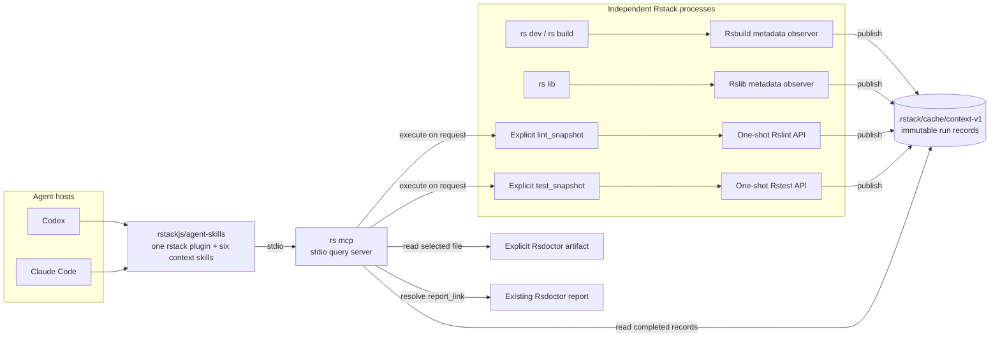
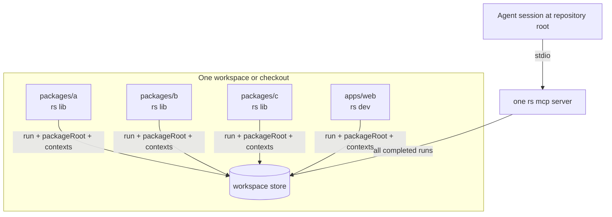
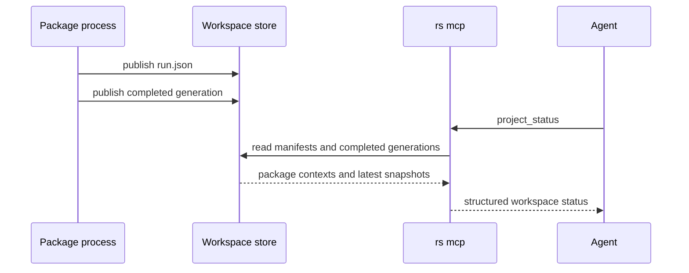
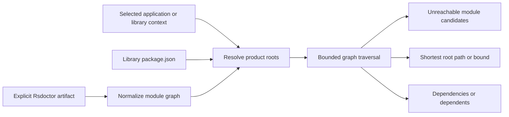
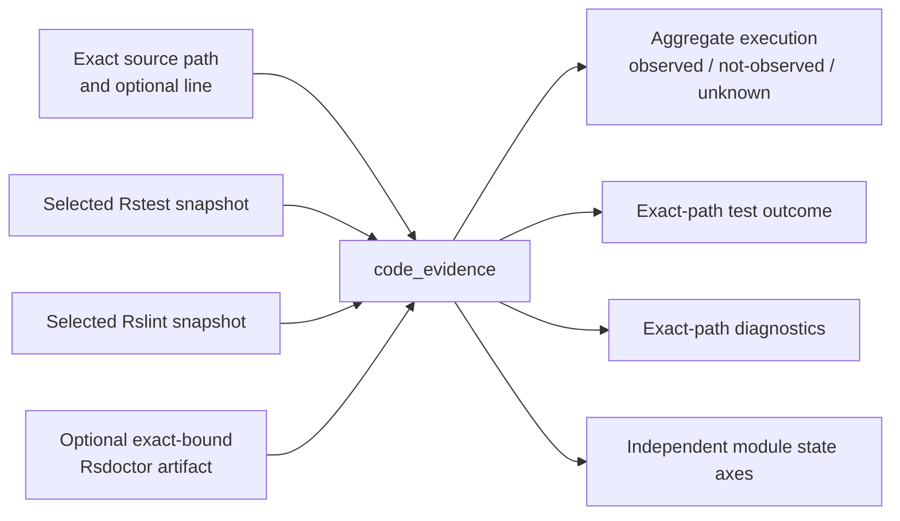
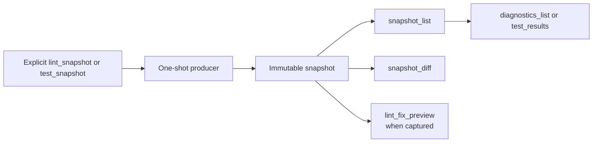
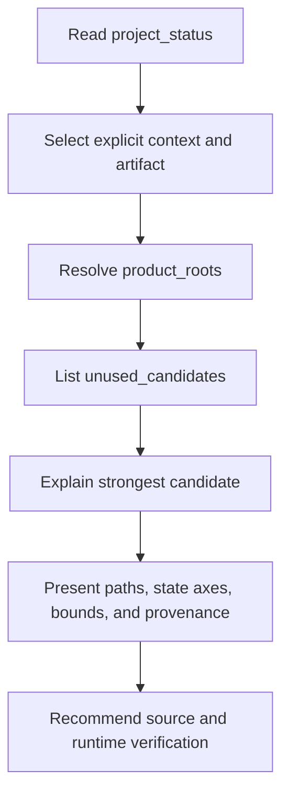
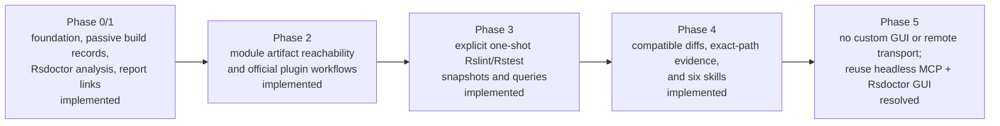

# RFC 0001: Rstack context engine

| Field   | Value                                                                             |
| ------- | --------------------------------------------------------------------------------- |
| Status  | Implemented downstream through Phase 4; Phase 5 resolved without a custom UI      |
| Created | 2026-08-12                                                                        |
| Target  | `rstack`, Rspack 2, Rsbuild 2, Rslib 1, Rstest 0.11, Rslint 0.7, and Rsdoctor 2   |
| Scope   | Headless build, lint, test, and artifact-scoped module evidence for coding agents |

## Summary

The Rstack Context Engine turns completed Rsbuild, Rslib, Rslint, and Rstest observations into
immutable records under the workspace cache. A single `rs mcp` process launched by an agent host
resolves the workspace root and exposes compact queries over those records. The same MCP also reads
explicit Rsdoctor artifacts for build analysis and module-level reachability.

This is deliberately a lean, file-based design:

- independent package processes publish records into one workspace store;
- one root-launched MCP reads every completed record in that store;
- no coordinator daemon, task-runner integration, package-process discovery service, or development
  server route is required;
- Rslint and Rstest execute only through explicit one-shot MCP tools;
- the repository-based `rstack` plugin in `rstackjs/agent-skills` registers `rs mcp` for Codex and
  Claude Code and provides six context workflows; and
- rich build visualization continues to use an existing Rsdoctor report through `report_link`.

The unused-code feature is intentionally artifact-scoped. It identifies modules that are not
reachable from selected roots in one Rsdoctor module graph. It does not prove that a local symbol or
export is unused across the repository.

## Motivation

Rstack already provides one CLI for applications, libraries, lint, and tests, but each underlying
tool observes a different part of development:

- Rsbuild and Rslib know which configurations and environments completed and which assets and chunks
  they emitted.
- Rspack supplies the compilation metadata used by those build observers.
- Rsdoctor provides a richer build artifact, module graph, optimization information, and focused
  analysis tools.
- Rslint provides structured diagnostics and optional whole-file fixed output.
- Rstest provides structured file, case, error, and run results.

Without a shared representation, an agent must run commands repeatedly, parse terminal output, and
guess which package, build, or source revision an observation describes. That becomes especially
ambiguous in monorepos where several Rslib packages and one or more Rsbuild applications run at the
same time.

The context engine gives those independent processes a small rendezvous format and gives agent hosts
one consistent query surface.

## Goals

- Provide one checkout-local MCP surface for Rstack evidence.
- Work in Rslib-only, Rsbuild-only, and mixed workspaces.
- Keep package and build identities independent from the MCP process current working directory.
- Record completed observations as immutable, schema-versioned files.
- Keep build, lint, test, and Rsdoctor evidence independently selectable and fresh.
- Reuse Rsdoctor artifacts and its existing GUI instead of duplicating them.
- Return bounded structured results with context, snapshot, freshness, completeness, and provenance.
- Provide task-oriented Codex and Claude Code skills for module reachability, change impact, build
  analysis, development diagnostics, and snapshot review.
- Keep context capture from changing the result of the underlying build command.

## Non-goals

- Proving arbitrary local-symbol or export dead code from a bundled artifact.
- Treating absence from one build graph as repository-wide proof of deletion eligibility.
- Starting background lint, test, build, watch, or indexing jobs when an MCP client connects.
- Controlling Rslint or Rstest watch sessions.
- Depending on Turbo, Nx, or another task runner.
- Running a coordinator daemon or discovering live package processes.
- Mounting MCP on an Rsbuild development-server route.
- Providing a custom context-engine GUI or remote MCP transport in this branch.
- Applying lint fixes or source edits.
- Replacing the full Rsdoctor report or general source-analysis tools.

## Architecture

### System overview



The build observers are appended to resolved in-memory Rsbuild or Rslib configuration. They record
completed environment compilations and do not modify the user's stored configuration. The lint and
test paths are different: `lint_snapshot` and `test_snapshot` are explicit MCP executions that
publish their results after the one-shot command completes.

### Component responsibilities

| Component              | Responsibility                                                                                   |
| ---------------------- | ------------------------------------------------------------------------------------------------ |
| Rsbuild/Rslib observer | Publish metadata for each completed build environment and watch generation.                      |
| Explicit capture       | Run one Rslint or Rstest request and publish its normalized result.                              |
| Workspace store        | Hold immutable run manifests and context generations shared by independent package processes.    |
| Rsdoctor adapter       | Read an explicit artifact, normalize its module graph, and invoke supported Agent CLI queries.   |
| Query layer            | Select contexts and snapshots, assess freshness, traverse module graphs, page, and diff results. |
| MCP server             | Expose the query and explicit-capture tools over stdio.                                          |
| Plugin skills          | Select the relevant tools and present their evidence boundaries to the model.                    |

The runtime is packaged separately from the CLI facade. `@rstackjs/context` owns the store,
producer adapters, normalized evidence, queries, and MCP implementation. `rstack` owns command and
configuration integration, exposes the runtime through `rstack/context`, and supplies the Rstack
config adapter when `rs mcp` runs explicit lint or test captures.

### Monorepo process model

The MCP process does not use its launch directory as a package or build identifier. `rs mcp` starts
at the host-provided current working directory, walks upward to the nearest workspace manifest, Git
checkout, or package root, and opens that workspace's store. Build processes perform the same
workspace resolution from their loaded config path while retaining their own package root.



This model has no dependency on the order in which processes start. Package commands may publish
before or after MCP starts, and multiple MCP readers can inspect the same immutable files. Turbo can
launch the commands, but the engine neither requires nor reads Turbo's task graph.

Each build context records:

- `contextId`;
- workspace-relative `packageRoot`;
- application or library `product`;
- optional package name and config path; and
- environment, target, and mode.

For build observations, `contextId` derives from the producer, package root, config path, product,
environment, command, mode, and target. It therefore distinguishes several builds in one process and
the same kind of build in different packages. Run IDs distinguish concurrent or repeated processes.

A single Rslib invocation can publish several library environments. A single Rsbuild invocation can
publish client, server, worker, or other configured environments. A workspace containing only Rslib
packages works without an Rsbuild application; an Rsbuild-only application works without Rslib; a
mixed workspace simply contributes both producer types to the same store.

`project_status` is how an agent chooses among those builds: it returns each `runId`, descriptor,
latest snapshot, and producer-specific freshness. Module analysis then requires that chosen
`contextId` plus an explicit Rsdoctor `dataFile`. The current adapter does not automatically bind the
file to the build observation; provenance labels the association `explicit-unverified` and includes
the latest build observation when one exists.

### Store layout and publication

```text
.rstack/cache/context-v1/
└── runs/
    └── <runId>/
        ├── run.json
        └── contexts/
            └── <contextId>/
                └── generations/
                    └── <sequence>-<snapshotId>.json
```

A producer writes an immutable run manifest followed by immutable completed snapshots. Publication
uses a same-directory temporary file and links it to its final generation name. Readers ignore
temporary and incomplete records. The cache is disposable; Rsdoctor source artifacts remain in
their original project-selected location.



## Producers and evidence

### Current support matrix

| Producer       | Activation                            | Current evidence                                                        |
| -------------- | ------------------------------------- | ----------------------------------------------------------------------- |
| Rsbuild/Rspack | `context.enabled: true` on Rstack app | Build status, hash, timing, environment, target, assets, chunks, bounds |
| Rslib/Rspack   | `context.enabled: true` on Rstack lib | The same metadata per generated library environment                     |
| Rsdoctor       | Explicit `dataFile` in an MCP query   | Agent CLI results and normalized artifact module graph                  |
| Rslint         | Explicit `lint_snapshot`              | File diagnostics, totals, input digests, optional fixed-output preview  |
| Rstest         | Explicit one-shot `test_snapshot`     | File, case, error, status, totals, and optional aggregate execution     |

Standalone Rspack processes are not automatically observed. In this implementation, Rspack metadata
arrives through the Rsbuild-compatible observer used by Rstack's app and library commands.

### Activation

Passive build metadata capture is opt-in:

```ts
export default define({
  context: {
    enabled: true,
    capture: 'metadata',
  },
});
```

`capture` accepts `off`, `metadata`, or `deep`. The current observer implements metadata capture;
when `deep` is selected, the snapshot records that the deep facet is unsupported rather than
inventing deeper evidence. `RSTACK_CONTEXT=1` enables metadata capture for a command and
`RSTACK_CONTEXT=0` disables it.

### Build metadata

The Rsbuild-compatible observer is appended after Rstack resolves the relevant app or library
configuration. For every completed environment compile it records:

- producer, command, mode, environment, target, watch state, and first-compile state;
- duration, compilation hash, error state, and warning state;
- a bounded asset list with sizes;
- a bounded chunk list with identifiers, files, and initial state; and
- dropped asset and chunk counts when metadata was truncated.

The observer catches its own capture failure, reports one warning, and leaves the build result
unchanged.

### Rsdoctor artifact model

Rsdoctor remains the build-analysis provider. The engine accepts an explicit
`rsdoctor-data.json`-style file, invokes the supported `@rsdoctor/agent-cli` catalog in-process only
when requested, and can link an existing HTML report or manifest. It does not require a browser or a
report server for normal MCP queries.

For reachability, the adapter normalizes the artifact's module graph into stable paths, import
edges, entry flags, chunk membership, optimizer bounds, and parse issues. Root selection then adds:

- production entries observed in the artifact;
- mapped `package.json` contract targets for library contexts;
- side-effect roots; and
- conservative roots for optimizer bailouts.

Published library analysis carries an open-world bound. A package contract target that cannot be
mapped to a module is also returned as a bound instead of being silently ignored.



The module queries expose four state axes: production reachability, public-contract status, shipped
chunk membership, and optimizer retention. They do not infer local-symbol reachability, export use,
test-only use, or runtime execution.

### Rslint snapshots

`lint_snapshot` creates one Rslint engine, runs either `lintFiles` or `lintText`, normalizes the
results, closes the engine, and publishes one completed snapshot. File mode defaults to the workspace
when no patterns are supplied. Text mode records a virtual-input digest.

When `includeFixPreview` is true, the snapshot may contain whole-file fixed output.
`lint_fix_preview` returns that stored output with the original digest; it never writes the file.

### Rstest snapshots

`test_snapshot` runs Rstest once through its programmatic API. The request can limit files and a test
name pattern. The resulting snapshot records normalized test files, cases, errors, totals, and the
run status. An explicit `execution` request also enables Istanbul for that one run and stores bounded
aggregate statement, function, and branch-arm locations with exact source digests. It does not
attribute coverage to individual tests. The source-input set remains partial because the adapter
does not record a complete dependency graph.

The branch does not attach to an existing watch process, control watch cycles, or keep a resident
Rstest session.

### Exact-path code evidence

`code_evidence` composes existing immutable records for one checkout-relative source path. It
selects the newest Rstest and Rslint snapshots whose package root contains the path unless explicit
snapshot IDs are supplied. An optional line narrows aggregate coverage locations. Both `contextId`
and `dataFile` are required to add an artifact module axis; no artifact is guessed. When one source
path has several artifact module variants, an optional `module` selector preserves the exact module
ID or name returned by the artifact query while `path` continues to select runtime and diagnostic
evidence.



Positive execution requires a positive stored hit and an exact current source digest. A zero-hit
result becomes `not-observed` only when the instrumented universe is complete and untruncated and
relevant locations exist. Missing, stale, partial, or truncated evidence stays unknown or
unavailable. Test outcomes do not imply a source-to-test relation, and module reachability,
shipment, public contract, and optimizer retention remain separate from runtime evidence.
No exact test record is unknown rather than not-run; not-run requires matching skipped or todo
records. Exact-path diagnostics are deterministically bounded to 200 items and report their total
and truncation. Module selection tries the workspace path before a package-relative fallback so
identical paths in sibling packages remain distinguishable. An explicit `module` selector bypasses
that path fallback and prevents a hashed or concatenated artifact variant from being silently joined
to a different module with the same source path.

### Freshness and compatible diffs

Lint and test snapshots record input digests. Query results assess those inputs against the current
workspace and report `fresh`, `stale`, `partial`, or `unknown` with changed paths where available.
Build, lint, and test freshness remain independent.

`snapshot_diff` compares only compatible immutable snapshots:

- the schema version must match;
- the producer must match;
- the context ID must match; and
- the capture selection must match; and
- both snapshots must contain the requested lint-diagnostic or test-result facet.

A compatible result contains added, removed, and changed items plus the independent freshness of
both sides. Test diffs include file errors, test cases, and unhandled run errors. An incompatible
result returns ordinary reasons and no inferred comparison.



## MCP contract

### Server lifecycle

The official `rstack` plugin in `rstackjs/agent-skills` registers one local stdio server named
`rstack` for both Codex and Claude Code. Its Node launcher first
resolves the workspace-root local `rstack` package and invokes its `rs` binary directly. When that
package is unavailable from the workspace root, the launcher falls back to `rs mcp` from the MCP
host `PATH`, inheriting standard input, output, and error and propagating the delegated process
result.

The plugin runtime launches in the agent session current working directory. `rs mcp` immediately
resolves the enclosing workspace root, so package identity comes from producer records rather than
from the MCP launch directory. The fallback also supports installations exposed through `PATH`,
including package-scoped monorepo tooling. No daemon handshake, port allocation, live-process
registry, or development-server connection is involved.

The MCP server reads structured content and returns an MCP `resource_link` only for an existing
Rsdoctor report. It does not currently register MCP resources, resource templates, prompts,
subscriptions, or a separate Rsdoctor MCP server.

### Tool catalog

The implemented server exposes these 15 tools:

| Tool                | Kind               | Purpose                                                               |
| ------------------- | ------------------ | --------------------------------------------------------------------- |
| `project_status`    | Query              | List package/build contexts and their latest completed observations.  |
| `product_roots`     | Query              | Resolve roots for one context and explicit Rsdoctor graph.            |
| `unused_candidates` | Query              | List artifact-scoped unreachable module candidates.                   |
| `dead_code_explain` | Query              | Explain one module's reachability, conservative retention, or bounds. |
| `module_impact`     | Query              | Traverse dependencies or dependents in one explicit artifact graph.   |
| `code_evidence`     | Query              | Join bounded exact-path evidence without collapsing independent axes. |
| `snapshot_list`     | Query              | Page immutable snapshots by producer or context.                      |
| `diagnostics_list`  | Query              | Page normalized Rslint or Rstest diagnostics.                         |
| `test_results`      | Query              | Page normalized test cases from a completed Rstest snapshot.          |
| `snapshot_diff`     | Query              | Compare diagnostics or tests from two compatible snapshots.           |
| `lint_fix_preview`  | Query              | Return stored fixed output without applying it.                       |
| `lint_snapshot`     | Explicit execution | Run one Rslint capture and publish its snapshot.                      |
| `test_snapshot`     | Explicit execution | Run one one-shot Rstest capture and publish its snapshot.             |
| `rsdoctor_analyze`  | Query              | Invoke one supported Agent CLI tool against an explicit data file.    |
| `report_link`       | Query              | Link an existing Rsdoctor HTML report or manifest.                    |

Snapshot and diagnostic/test lists use bounded limits and opaque cursors. Module traversal has
bounded depth and visit counts and reports whether analysis or result paging truncated the answer.
All artifact tools require an explicit `dataFile`; the server neither starts a build nor guesses
which Rsdoctor artifact the user intended.

### Module claim vocabulary

The reachability tools use four classifications:

| Classification                   | Meaning                                                             |
| -------------------------------- | ------------------------------------------------------------------- |
| `reachable`                      | A production or contract root has a path to the module.             |
| `preserved-by-conservative-root` | An optimizer/side-effect root has a path to the module.             |
| `unreachable-module-candidate`   | No selected root reaches it within the complete traversal.          |
| `insufficient-evidence`          | Missing roots or traversal bounds prevent a complete module result. |

An `unreachable-module-candidate` is a request for source and runtime verification, not a deletion
decision. Export-level and local-symbol conclusions remain outside this branch.

## Agent plugin distribution

The installable host integration lives in
[`rstackjs/agent-skills`](https://github.com/rstackjs/agent-skills), not in this runtime repository.
It extends that repository's existing `rstack` plugin rather than creating another plugin or
marketplace:

```text
agent-skills/
├── .codex-plugin/
├── .claude-plugin/
├── .agents/plugins/marketplace.json
├── .mcp.json
└── skills/
    ├── analyze-build/
    ├── assess-change-impact/
    ├── debug-dev-cycle/
    ├── explain-dead-code/
    ├── find-unused-code/
    └── review-context-change/
```

The Codex and Claude manifests discover the same root `skills/` directory and `.mcp.json`. The
launcher uses the workspace-root local `rstack` package when available and otherwise expects `rs`
on the host `PATH`. The plugin contains no copy of `@rstackjs/context`, compiler graph, store, or MCP
implementation.

### Skill catalog

| Skill                   | Typical request                   | Tool sequence                                                                  |
| ----------------------- | --------------------------------- | ------------------------------------------------------------------------------ |
| `find-unused-code`      | "Find unused modules"             | `project_status` → `product_roots` → `unused_candidates` → `dead_code_explain` |
| `explain-dead-code`     | "Why is this module included?"    | `dead_code_explain` with one context, artifact, and module selector            |
| `assess-change-impact`  | "What depends on this module?"    | `module_impact` in the dependent direction                                     |
| `analyze-build`         | "Why is this bundle large?"       | `project_status` → focused `rsdoctor_analyze` → optional `report_link`         |
| `debug-dev-cycle`       | "What lint or tests are failing?" | status/snapshot queries, then an explicit capture only when requested          |
| `review-context-change` | "What changed after this edit?"   | `snapshot_list` → `snapshot_diff` → optional `lint_fix_preview`                |

The skills keep build-artifact conclusions scoped to the selected context and file. They also keep
querying separate from execution: `lint_snapshot` and `test_snapshot` run only when fresh results
are requested, and the preview tool never applies a change.

### Unused-module workflow



The MCP view returns a bounded `product_roots` sample plus `rootSummary` counts. Unused candidates
are ordered with project-owned modules first and include complete-result `ownership` counts, so an
agent does not page through dependency-only results looking for source that is not present. This
keeps the first agent turn useful even when a production artifact contains thousands of roots or
candidates.

## Delivery status



### Phase 0/1: foundation and build evidence

Implemented downstream:

- workspace/package discovery independent of Turbo or another task runner;
- immutable run manifests and context generations;
- deterministic status across independent package processes;
- opt-in Rsbuild and Rslib metadata observers;
- the root-resolving `rs mcp` stdio server;
- explicit Rsdoctor Agent CLI analysis; and
- optional links to existing Rsdoctor reports.

### Phase 2: module artifact reachability and bundles

Implemented downstream:

- normalized Rsdoctor module graphs;
- application entries, library contract targets, and conservative roots;
- bounded root reachability, shortest explanations, and impact traversal;
- the four module-analysis MCP tools; and
- one shared Codex and Claude Code integration in `rstackjs/agent-skills`.

The implementation reports module candidates only. Export usage and local-symbol dead-code claims
were not added.

### Phase 3: explicit development snapshots

Implemented downstream:

- one-shot Rslint snapshots with normalized diagnostics;
- one-shot Rstest snapshots with normalized file and case results;
- optional bounded aggregate Istanbul execution evidence;
- producer-specific freshness; and
- paginated snapshot, diagnostic, and test-result queries.

Passive lint/test attachment, watch control, resident workers, type-check/timing capture,
per-test coverage attribution, and related-test graph APIs remain deferred.

### Phase 4: review workflows

Implemented downstream:

- compatibility-checked diagnostic and test diffs;
- stored lint fixed-output previews without apply;
- the `code_evidence` exact-path composition query;
- `debug-dev-cycle` and `review-context-change`; and
- the complete six-skill set in the official `rstack` plugin.

CI artifact exchange, performance budgets, apply tools, automatic verification, and export-level
diffs remain deferred.

### Phase 5: presentation decision

Resolved for this branch: no custom GUI, MCP app, report server, or remote transport is needed. The
headless MCP results cover agent workflows, and `report_link` reuses an existing Rsdoctor report when
a human needs the richer visualization. A future presentation layer should be considered only after
a specific workflow cannot be expressed clearly through the current structured tools and report
link.

### Multi-axis usage evidence

This branch begins adapting Hawk's central idea: collect independent evidence for production
and non-production targets, then decide reachability only after those fragments are joined. Hawk's
non-production graph shows what test and development targets import or reach; it is not runtime
coverage and does not prove that a test or branch executed.

Rstack should preserve the following independent evidence axes:

| Axis                     | Question answered                                                    |
| ------------------------ | -------------------------------------------------------------------- |
| Production-reachable     | Can a selected product root reach this module or export?             |
| Test-related/imported    | Does a selected test target relate to or import it?                  |
| Executed/covered         | Did runtime coverage observe its statements, functions, or branches? |
| Shipped/retained         | Did the emitted product contain or conservatively retain it?         |
| Public-contract-required | Must a selected library or external contract continue to expose it?  |

An absent or unknown result on one axis does not decide another. In particular, `not-covered` must
never collapse to `dead`. This is an evidence-composition feature, not a security framework or a
deletion oracle.

Ownership stays upstream where the underlying facts are produced. Rstest owns instrumentation,
coverage, related-test selection, watch-cycle events, and test-file attribution. Rspack and Rsdoctor
own production and test module/export graphs plus product roots. Rstack owns immutable snapshots,
exact identity and freshness joins, and the MCP and skill surfaces that explain the combined
evidence; it should not duplicate those compiler graphs or test instrumentation.

The lean delivery sequence is:

1. Aggregate existing Istanbul evidence into immutable snapshots and expose it through bounded
   exact-path composition. This branch implements this step.
2. Add the existing Rstest related-file CLI output as a distinct static relation when a stable
   structured seam is available.
3. Consume upstream Rstest test-file attribution and watch-cycle events when they are available.
4. Join axes only when workspace, package, context, and exact input or graph digests match; otherwise
   report the evidence separately with its freshness.

The implemented `code_evidence` query covers only aggregate execution, exact-path outcomes and
diagnostics, and an optional explicit artifact module. It does not claim per-test attribution or a
source-to-test relationship.

## Deferred extensions

The following are potential later work, not part of the implemented contract:

- supported Rsdoctor export-usage and local-binding data;
- direct standalone Rspack instrumentation;
- passive Rslint/Rstest sessions and watch-cycle control;
- static related-test evidence, per-test coverage attribution, and watch-cycle evidence;
- build, lint, or test subscriptions;
- CI artifact import/export and performance gates;
- source mutation and apply/verify flows;
- retention policies beyond disposable cache cleanup;
- a coordinator daemon, remote transport, or custom visual surface; and
- repository-wide claims that combine several artifact graphs automatically.

These additions should continue using the same workspace, context, run, snapshot, and provenance
identities so the file-based implementation remains the compatibility boundary.

## Validation

The downstream implementation includes focused coverage for:

- workspace discovery and config injection;
- immutable store publication and record validation;
- numeric generation ordering and project status;
- Rsbuild/Rslib metadata capture;
- Rsdoctor artifact selection, graph normalization, and Agent CLI loading;
- application and library root resolution;
- reachability, explanations, and impact traversal;
- Rslint and Rstest snapshot normalization and freshness;
- aggregate execution normalization and exact-path code evidence;
- paging, compatible diffs, and lint previews;
- the 15-tool MCP catalog and stdio behavior; and
- both plugin manifests, MCP registration, and six-skill layouts.

The branch's repository verification matrix is `pnpm check`, `pnpm check:spell`, `pnpm build`,
`pnpm --filter rstack build:native`, and `pnpm test`.

## Acceptance criteria

This lean implementation is complete when:

1. A root-launched agent can enumerate completed contexts from several Rslib packages and Rsbuild
   applications without knowing their process directories.
2. Rslib-only, Rsbuild-only, and mixed workspaces publish into the same store format.
3. An agent can select one context and explicit Rsdoctor artifact before asking for roots,
   candidates, explanations, impact, or focused build analysis.
4. Every unused result is presented as an artifact-scoped module candidate with bounds and
   provenance.
5. Lint and test captures are explicit one-shot operations whose immutable results can be queried
   and compared independently from build status.
6. A lint fixed-output preview can be reviewed without applying it.
7. Codex and Claude Code expose the same MCP command and the same six task skills.
8. The normal workflow requires neither a daemon nor a GUI; an existing Rsdoctor report remains
   available through `report_link`.

## References

- [Astral Hawk architecture](https://github.com/astral-sh/hawk/blob/main/docs/architecture.md)
- [Model Context Protocol tools](https://modelcontextprotocol.io/specification/2025-11-25/server/tools)
- [Rspack Stats JSON](https://rspack.rs/api/javascript-api/stats-json)
- [Rspack tree shaking](https://rspack.rs/guide/optimization/tree-shaking)
- [Rsbuild plugin hooks](https://rsbuild.rs/plugins/dev/hooks)
- [Rslib JavaScript API](https://lib.rsbuild.dev/api/javascript-api/instance)
- [Rslint JavaScript API](https://rslint.rs/guide/js-api)
- [Rstest JavaScript API](https://rstest.rs/api/javascript-api)
- [Rsdoctor AI integration](https://rsdoctor.rs/guide/start/ai)
- [Rsdoctor pull-request preview packages](https://github.com/web-infra-dev/rsdoctor/pull/1900)
- [Codex plugin packaging](https://developers.openai.com/plugins/build/plugins)
- [Claude Code plugin reference](https://code.claude.com/docs/en/plugins-reference)
