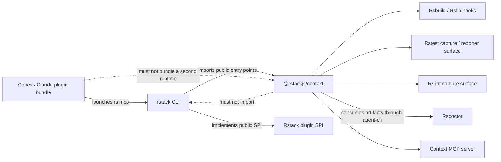

# Context Plugin Boundary Design

<!-- cspell:ignore Kiali Midscene -->

**Status:** Approved

**Related work:**

- Rstack CLI plugin SPI: [rstackjs/rstack-cli#336](https://github.com/rstackjs/rstack-cli/pull/336)
- Rstack Context integration: [rstackjs/rstack-cli#344](https://github.com/rstackjs/rstack-cli/pull/344)
- Standalone Context package: [rstackjs/context#1](https://github.com/rstackjs/context/pull/1)
- Agent plugin bundle: [rstackjs/agent-skills#102](https://github.com/rstackjs/agent-skills/pull/102)

## Goal

Make `@rstackjs/context` an independently usable context runtime with no dependency on the `rstack`
package or its internal modules. Rstack CLI depends on Context and consumes its public `./rstack`
entry point through the plugin SPI from PR #336.

The integration should be concentrated in a small CLI-owned host adapter. Direct consumers must still
be able to use the individual Rsbuild, Rslib, Rstest, Rslint, Rsdoctor, storage, and MCP capabilities
without adopting Rstack CLI.

## Dependency direction



The dashed Context-to-CLI edge is forbidden. `@rstackjs/context` must not declare a runtime, peer,
development, or type-only package dependency on `rstack`.

## Package entry points

Context keeps its root barrel for compatibility and adds focused public entry points:

| Entry point                  | Responsibility                                                                                                    |
| ---------------------------- | ----------------------------------------------------------------------------------------------------------------- |
| `@rstackjs/context`          | Backward-compatible aggregate API and shared evidence/store types                                                 |
| `@rstackjs/context/rsbuild`  | Rsbuild build observer plugin, config append helper, and build types                                              |
| `@rstackjs/context/rslib`    | Rslib-facing contributor built on the same Rsbuild environment hooks                                              |
| `@rstackjs/context/rstest`   | Explicit Rstest capture API, related-test contracts, execution evidence, and reporter surface when used           |
| `@rstackjs/context/rslint`   | Explicit Rslint capture API and diagnostic/fix-preview queries                                                    |
| `@rstackjs/context/rsdoctor` | Consumer APIs for Rsdoctor artifact discovery, graph normalization, analysis, and reports; not an Rsdoctor plugin |
| `@rstackjs/context/mcp`      | Context MCP server and host-dependency contracts                                                                  |
| `@rstackjs/context/rstack`   | Combined Rstack plugin entry point composed from the focused APIs                                                 |

The focused entry points expose real Context capabilities; they are not wrappers around `rs` commands.
They remain usable in repositories that adopt only one producer. Missing producers degrade to
unavailable evidence and do not prevent other entry points from loading.

The Rstest subpath initially exports the supported one-shot capture and execution-evidence surfaces.
Any watch reporter added later belongs on this subpath and must keep static relation, test outcome,
and runtime execution evidence separate.

## Rsdoctor boundary

The dependency direction is one way: Context consumes Rsdoctor; Rsdoctor does not consume Context.
Context does not export an Rsdoctor build plugin and Rsdoctor does not import
`@rstackjs/context`.

Rsdoctor's own build plugin produces `rsdoctor-data.json`. Context reads that completed artifact
through the pinned `@rsdoctor/agent-cli` adapter, normalizes the relevant graph and section evidence,
and exposes the results through `@rstackjs/context/rsdoctor` and the Context MCP server. The
`./rsdoctor` name describes this consumer-facing Context API, not a plugin installed into Rsdoctor.

## Rstack entry point without reverse coupling

`@rstackjs/context/rstack` exports `createRstackContextPlugin(options)`. The returned object is
structurally compatible with the public Rstack plugin SPI (`name` plus `setup`) but Context defines
the minimal structural contract locally. It does not import types or runtime code from `rstack`.

Rstack CLI performs a compile-time compatibility assignment at its adapter boundary:

```ts
import { createRstackContextPlugin } from '@rstackjs/context/rstack';
import type { RstackPlugin } from './plugin.ts';

const plugin: RstackPlugin = createRstackContextPlugin(options);
```

If the SPI changes incompatibly, the Rstack CLI build fails at this one boundary. Context itself can
still build, test, and publish without `rstack` installed.

## Stacking on the plugin SPI

PR #344 is stacked on PR #336. Context is registered as an internal Rstack plugin, not a plugin that
users must repeat in `define.plugins()`.

The plugin runtime composes plugins in this order:

1. user plugins in declared order;
2. the internal Context plugin.

This preserves the user-plugin ordering contract and lets Context observe the final native build
configuration without becoming a special case in every tool loader. `define.context()` remains the
small first-party configuration surface for enabling capture, selecting metadata/deep capture, and
setting a variant.

The SPI gains one small typed addition: configuration modifier handlers receive native invocation
context as their second argument. The map is specific to each tool kind, so application, library, and
test modifiers receive their native `ConfigParams`; other kinds receive an empty context until they
have a concrete need. Existing one-argument modifiers remain source-compatible.

This is needed because build evidence must use the native command and environment mode supplied by
Rsbuild or Rslib. It must not infer them from `process.argv`.

## CLI-owned adapter

Rstack-specific behavior is consolidated in one internal module, tentatively
`packages/rstack/src/contextPlugin.ts`. It owns only the host knowledge Context cannot own:

- loading `define.context()` from the selected Rstack config;
- supplying the loaded config path and dependency files;
- assigning the Context plugin to `RstackPlugin` at compile time;
- supplying Rstack's Rslint and Rstest wrapper-config paths;
- running explicit capture inside `withRstackConfigTarget()`;
- detecting whether `define.test()` exists for a selected package;
- resolving related tests through the current `rs test list` behavior;
- connecting the MCP server to stdio while reserving stdout for JSON-RPC.

The rest of the CLI sees narrow functions from this module rather than importing Context primitives
throughout tool loaders.

Expected long-term CLI coupling is limited to:

1. the package dependency and public `rstack/context` re-export;
2. `ContextConfig` in `Configs` and `define.context()`;
3. internal plugin registration in the plugin runtime;
4. built-in `rs mcp` dispatch to the CLI-owned adapter.

`rs mcp` remains a built-in command rather than a project-configured plugin command. This reserves
stdout before the MCP transport starts and allows the server to launch even when no Rstack config is
present. Moving it behind ordinary plugin-command discovery would unnecessarily execute project
configuration before protocol setup.

## Build integration

The Context Rstack plugin registers `app` and `lib` config modifiers. Each modifier:

1. resolves the Context workspace from the loaded config or invocation root;
2. records the loaded Rstack config and dependency inputs once;
3. creates the appropriate Context build observer with native `ConfigParams`;
4. appends exactly one observer to the resolved native plugin list;
5. preserves the user's config object and existing plugins.

The application modifier records `producer: 'rsbuild'` and `product: 'application'`. The library
modifier records `producer: 'rslib'` and `product: 'library'`. Repositories may use either or both.

Rstest automatic `extends` continues to apply application or library modifiers through the normal
SPI path. Explicit `extends` keeps its existing opt-out semantics. Tests must prove that the observer
is not duplicated when automatic inheritance and a native build command both occur in separate
invocations.

## Explicit lint and test capture

Lint and test capture remain Context-owned operations exposed through the MCP dependency contract.
The CLI adapter provides only host callbacks:

```text
Context capture algorithm
  -> asks host to select/load Rstack config
  -> invokes Rslint or Rstest through the supplied wrapper config
  -> stores normalized evidence in Context
```

This keeps Context independent from Rstack config internals while preserving correct per-package
selection in monorepos. A project with no Rstest configuration can still use build, Rsdoctor, and
Rslint evidence. A project with no Rslint configuration can still use every other available axis.

## Agent plugin bundle

The Agent Skills repository does not depend on or bundle another Context runtime. Its local stdio
launcher discovers the workspace's `rstack` executable and runs `rs mcp`. Skills describe workflows
over the MCP contract.

This keeps one runtime and one store per checkout:

```text
Agent skill -> installed plugin launcher -> workspace rs mcp
            -> Rstack host adapter -> @rstackjs/context
```

Plugin tests should use Rstack and Context preview packages, but published plugin metadata remains
repository-based rather than an npm dependency graph.

## Preview dependency policy

Published Context previews must contain ordinary semver dependencies. A pkg.pr.new URL must not be
published as a transitive dependency because repositories using `blockExoticSubdeps` correctly
reject it.

Context may validate against a Rsdoctor preview through a root-only pnpm override. The packed Context manifest
must retain the supported semver dependency. Rstack CLI then depends on the latest Context preview
for cross-repository validation.

## Compatibility and tests

The refactor preserves the current root exports and MCP schemas. Required validation includes:

- Context builds and tests with no `rstack` package installed;
- every focused Context subpath imports independently;
- the packed Context manifest contains no exotic transitive dependency;
- Rstack compile-time compatibility for `createRstackContextPlugin()`;
- one Context observer for Rsbuild-only, Rslib-only, and mixed configurations;
- correct native command/mode/config provenance from modifier invocation context;
- no Context observer when capture is off;
- explicit lint/test MCP capture still uses the selected package/config;
- missing Rstest or Rslint degrades without affecting build/Rsdoctor queries;
- `rs mcp` works without project configuration;
- Agent plugin launcher works against the stacked Rstack/Context previews.

After repository tests pass, validate the installed plugin against at least:

- HeaderEditor for Rsbuild-only graceful degradation;
- Kiali for Rsbuild plus Rstest;
- Midscene for Rsbuild, Rslib, and Rstest in a monorepo;
- one Rspack-only or Rspack 1.x project to verify unsupported axes remain explicit.

## Alternatives considered

### Keep bespoke calls in every tool loader

This requires fewer immediate changes but leaves Context behavior spread across Rsbuild, Rslib, MCP,
and config modules. It duplicates the composition mechanism added by PR #336 and makes future
producer entry points harder to add consistently.

### Make Context depend on `rstack`

Context could import `RstackPlugin` directly and declare a peer dependency. This creates a reverse
package edge and prevents Context from being a genuinely standalone producer/MCP runtime. Structural
compatibility at the CLI boundary provides the same type check without the cycle.

### Run Context only through subprocess commands

This minimizes in-process imports but loses native configuration parameters and build lifecycle
hooks, weakens monorepo selection, and adds transport/process complexity. The plugin SPI plus native
tool hooks is both simpler and more accurate.
