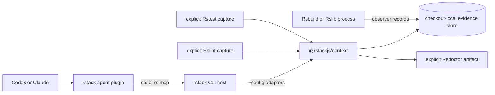

# Rstack Context repository extraction design

## Status

Approved on 2026-08-14.

## Summary

Extract the existing `@rstackjs/context` package from `rstackjs/rstack-cli` into a new public
`rstackjs/context` repository while preserving the package's focused Git history. Keep Rstack CLI as
the thin host integration and keep the repository-distributed agent plugin in `rstackjs/agent-skills`.

This is a repository and release-boundary change, not a context-engine redesign. The package name,
public exports, evidence model, store layout, MCP tools, and agent workflows remain compatible.

## Goals

- Create the public `rstackjs/context` repository.
- Preserve the commits that changed `packages/context` without importing unrelated Rstack CLI history.
- Move the context runtime, tests, fixtures, architecture documentation, and package release ownership
  into that repository.
- Build with Rslib, test with Rstest, and lint with Rslint.
- Add pkg.pr.new previews for `@rstackjs/context` pull requests.
- Keep `rs mcp` as the agent plugin's single runtime entry point.
- Keep Rstack-specific configuration and command integration in `rstackjs/rstack-cli`.
- Keep the Codex and Claude plugin bundle and its skills in `rstackjs/agent-skills`.

## Non-goals

- Do not redesign the MCP tool catalog or evidence semantics during extraction.
- Do not add a daemon, network service, live process registry, or second MCP server.
- Do not split the context runtime into several packages.
- Do not embed runtime implementation in the agent plugin.
- Do not add an artificial Rsbuild application solely to exercise Rsbuild.
- Do not add npm release machinery to the repository-based agent plugin.

## Repository ownership

### `rstackjs/context`

The new repository owns:

- the `@rstackjs/context` package and public exports;
- the immutable run, context, snapshot, freshness, completeness, and provenance model;
- the checkout-local store and workspace resolution;
- Rsbuild and Rslib build observers;
- explicit Rslint and Rstest capture and normalized results;
- optional aggregate execution coverage evidence;
- Rsdoctor artifact reading, graph normalization, and Agent CLI integration;
- reachability, product-root, impact, diff, diagnostic, test-result, and composed evidence queries;
- the MCP server and tool schemas;
- engine unit tests, integration fixtures, README, and architecture RFC;
- package CI and pkg.pr.new preview publication.

### `rstackjs/rstack-cli`

Rstack CLI retains:

- the `rs mcp` command and stdio transport;
- Rstack configuration target selection;
- generated Rslint and Rstest wrapper configuration paths;
- the Rstest related-test CLI adapter;
- Rsbuild and Rslib configuration injection;
- the `rstack/context` compatibility re-export;
- CLI adapter and command integration tests;
- user-facing `rs mcp` and Rstack configuration documentation.

### `rstackjs/agent-skills`

Agent Skills retains:

- the existing Rstack Codex and Claude plugin manifests;
- the launcher that resolves a workspace-local `rstack` package and invokes `rs mcp`;
- context workflows, skills, references, and evaluations;
- installation and real-world evaluation documentation.

It contains no context engine, store, graph, or MCP implementation.

## Runtime architecture



The agent-facing launch path remains unchanged. Moving the runtime package does not introduce a new
binary or require the agent plugin to understand package roots, monorepo topology, or build process
discovery.

## Package structure

```text
rstackjs/context/
├── .github/workflows/
│   ├── ci.yml
│   └── pkg-pr-new.yml
├── docs/
│   └── rfc.md
├── src/
├── tests/
├── package.json
├── pnpm-workspace.yaml
├── rslib.config.ts
├── rstest.config.ts
├── Rslint configuration
├── tsconfig.json
├── README.md
└── LICENSE
```

The repository is intentionally a single-package workspace. A pnpm catalog keeps the Rstack tool
versions explicit and reviewable.

## Tooling

- Rslib builds the ESM library and declarations.
- Rstest runs the package test suite and optional coverage checks.
- Rslint performs lint and type-aware checks.
- Rsbuild remains a runtime API because context observers integrate with Rsbuild and Rslib builds
  through the Rsbuild/Rspack stack.
- pnpm uses the version declared by the source Rstack CLI repository unless a newer organization
  convention is required during implementation.

The standalone package must not depend on `rstack` for its own build or checks because `rstack`
depends on `@rstackjs/context`. Avoiding that development dependency keeps the dependency graph
acyclic and makes the package independently buildable.

## History migration

Create a minimal default branch in `rstackjs/context`, then create `codex/extract-context`. Generate
a subtree history rooted at `packages/context` from the current Rstack context branch and merge that
history into the extraction branch with unrelated histories allowed. Add standalone repository
scaffolding in later commits.

This preserves package-level commits and blame while excluding unrelated CLI files and commits. The
extraction remains a normal draft pull request rather than placing not-yet-reviewed runtime code directly
on the new repository's default branch.

## Public compatibility

- Preserve the npm package name `@rstackjs/context`.
- Preserve the root and `./mcp` exports.
- Preserve the current Node engine requirement unless verification proves it can be relaxed.
- Update package repository, bugs, and homepage metadata for `rstackjs/context`.
- Keep `rstack/context` as a compatibility re-export.
- Keep all 15 MCP tool names and current structured result contracts during extraction.
- Keep the checkout-local store schema and paths compatible.

## Release and integration sequence

1. Create `rstackjs/context` with a minimal default branch.
2. Open a draft extraction pull request containing preserved package history and standalone tooling.
3. Publish `@rstackjs/context` previews from that pull request with pkg.pr.new.
4. Update the existing Rstack CLI draft pull request to remove `packages/context` and consume the
   preview for cross-repository verification.
5. Update Agent Skills repository links and evaluation fixtures only where repository ownership
   changed; its launcher continues to call `rs mcp`.
6. Evaluate the installed plugin against real Rsbuild, Rslib, and Rstest repositories with graceful
   degradation when any producer is absent.
7. Publish a stable `@rstackjs/context` version before the Rstack CLI pull request becomes merge-ready.
8. Replace the preview dependency with the stable version and keep all coordinated pull requests in
   draft until their dependency order is satisfied.

## Graceful degradation

The extraction preserves the existing independent evidence lanes:

- an Rsbuild-only project can expose build and Rsdoctor evidence without Rstest or Rslint;
- an Rslib-only project can expose library build contexts without an application build;
- Rslint and Rstest captures run only when their explicit tools are called and dependencies exist;
- missing coverage leaves execution evidence unavailable rather than zero;
- missing Rsdoctor data leaves artifact queries unavailable without affecting stored snapshots;
- missing producers never prevent `project_status` from reporting available contexts.

## Verification

The new repository must pass:

- clean install with the declared pnpm version;
- Rslib build and declaration generation;
- Rstest unit and integration suites;
- Rslint and type-aware checks;
- package packing and import from a clean consumer;
- MCP protocol smoke tests and the complete tool catalog test;
- pkg.pr.new preview installation from a clean consumer.

Rstack CLI must pass:

- package build and native build prerequisites;
- adapter and `rs mcp` integration tests;
- Rsbuild and Rslib observer injection tests;
- explicit Rslint and Rstest capture tests;
- full repository checks required by its `AGENTS.md`.

Agent Skills must pass:

- plugin manifest validation;
- Codex and Claude skill parity checks;
- MCP launcher smoke tests using the context preview through Rstack CLI;
- real-repository evaluations with partial tool availability.

## Rollback

Until the standalone package has a stable release, Rstack CLI can continue using its workspace copy.
The extraction pull request and preview dependency are independently reversible. No store migration
or user configuration change is required.
